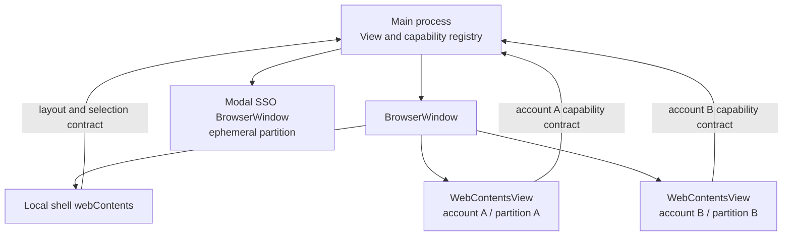

# Main-owned account views with a sandboxed local shell

## Context

At the start of modernization, the local renderer created DOM `<webview>` elements for remote account content, the remote preload was unsandboxed, context isolation was disabled, and `@electron/remote` was enabled. SEC-002–006 have since added registered authority, isolated bridges and sandboxing and removed remote; production account view creation and state still need the cutover below. Electron recommends avoiding `<webview>`, and the target invariants require main-owned identity and capability boundaries.

## Options considered

| Option | Material trade-off |
| --- | --- |
| Harden the existing `<webview>` architecture | Lowest initial UI churn, but preserves renderer-owned view creation and an API Electron does not recommend for new architecture |
| Use iframes | Simple layout, but insufficient session/process ownership and desktop integration control for isolated accounts |
| Use `BrowserView` | Main-owned, but deprecated in favor of `WebContentsView` |
| Use main-owned `WebContentsView` instances | Supported main-process ownership and explicit composition; requires a layout/focus bridge and deliberate lifecycle cleanup |
| One native window per account | Strong ownership but materially changes product UX, window/tray behavior, and cross-account interaction |

## Decision

Use one `BrowserWindow` for the packaged local shell and one main-process-owned `WebContentsView` per remote account. `BrowserWindow` already participates in the `BaseWindow` view hierarchy, so its `contentView` owns account views without introducing an additional top-level window abstraction.

The local shell:

- Loads from a privileged application scheme, not `file://`, with a restrictive production CSP.
- Runs sandboxed with context isolation and no Node integration.
- Receives only shell layout/selection commands through a typed preload bridge.
- Cannot construct, adopt, or obtain raw `WebContents` or session identifiers.

Each account view:

- Is created and destroyed only by the main process.
- Uses a unique main-generated persistent partition bound to one account record.
- Preserves an existing profile's validated default-session or `persist:UUID` mapping during one-time migration; never silently generates replacement partitions for existing logins. New accounts receive main-generated isolated partitions.
- Runs sandboxed and context-isolated with Node integration and `<webview>` disabled.
- Has a minimal versioned preload bridge whose capability set is registered before navigation.
- Is authorized by exact `WebContents` and frame identity; account IDs supplied by renderer payloads are never authoritative.

SSO uses a separate modal `BrowserWindow` with an in-memory nonce-specific session, no Node integration, no privileged preload, permissions denied, explicit navigation policy, and guaranteed teardown on success, error, cancellation, or crash.

## Lifecycle contract

An account view moves through `absent -> creating -> registered -> navigating -> ready -> hidden|visible -> destroying -> absent`. Registration of identity, partition, allowed origins, view type, and capabilities occurs before the first remote navigation. IPC from any other state fails closed.

- Creation failure removes the provisional registry entry and closes the `WebContents`.
- Switching accounts changes visibility, bounds, focus, and accessibility state; it does not change identity or partition.
- The main process calculates account bounds from validated shell chrome measurements and applies them on window resize. The shell cannot supply arbitrary native-window bounds.
- A renderer crash removes active authority before offering recovery. Recovery creates a new `WebContentsView` bound to the same validated account/partition and performs a fresh registration/navigation sequence.
- Account removal closes the `WebContents`, removes it from the view tree and registry, unregisters scoped handlers, and then applies the approved storage-deletion policy.
- Closing the parent explicitly closes every child view's `webContents`; `BaseWindow` ownership alone does not destroy them.
- Popup, navigation, permission, download, and certificate handlers consult the same immutable registry identity and default to deny.

## Consequences

Native-account preloads receive the immutable App-lock override boolean through main-owned startup arguments, alongside existing locale/environment bootstrap. The production cutover reproduced synchronous managed-config IPC before the frame had a committed URL, causing authorized-origin rejection and a startup stall. Bootstrap must not require an early-origin authorization exception. Missing, malformed or duplicate policy arguments prevent native bridge installation; both true and false are explicit. The legacy preload retains its existing contract until its retirement; no runtime permission or configuration-write capability is added.

Production composition keeps the existing account sidebar and uses a main-owned native popup for its existing logout/remove actions. Account views are native siblings rather than DOM children, so the old HTML menu cannot simply overlay them with CSS; a native menu avoids another renderer/window or hiding account content. Only the account ID crosses the shell boundary, and main derives menu entries and targets from its current records. A small reserved shell header keeps the existing unfinished-login cancellation control reachable. Keyboard invocation and focus restoration remain acceptance tests, not waived UI behavior. This follows Electron's [native view ordering](https://www.electronjs.org/docs/latest/api/view#viewaddchildviewview-index) and [main-process menu API](https://www.electronjs.org/docs/latest/api/menu).

This removes renderer-owned `<webview>` creation and provides one main-process source of truth for account authorization. It also makes layout coordination, focus/accessibility behavior, crash recovery, and child `WebContents` cleanup explicit responsibilities. A narrow webapp adapter may be required because the existing preload mutates remote globals directly; that contract must be coordinated under Q-003 rather than recreating the legacy global surface.

## Validation

- A one-account M2 spike must demonstrate view composition, resize/focus, crash recovery, navigation denial, and explicit destruction on all supported platforms.
- Hostile-renderer tests must fail to access raw IPC, Electron/Node, another account, unknown frames, or capabilities not registered to the view.
- Multi-account, SSO, calling/display capture, tray/notification routing, proxy/certificate, deep-link, and packaged tests remain capability gates.
- The solo maintainer reviewed the architecture and security consequences through PR #1. Its merge records acceptance without claiming independent review.

## Revisit conditions

Revisit if Electron deprecates `WebContentsView`, the M2 spike reveals an unresolvable accessibility/focus defect, platform performance is unacceptable, or the required webapp adapter would broaden rather than narrow privilege.
