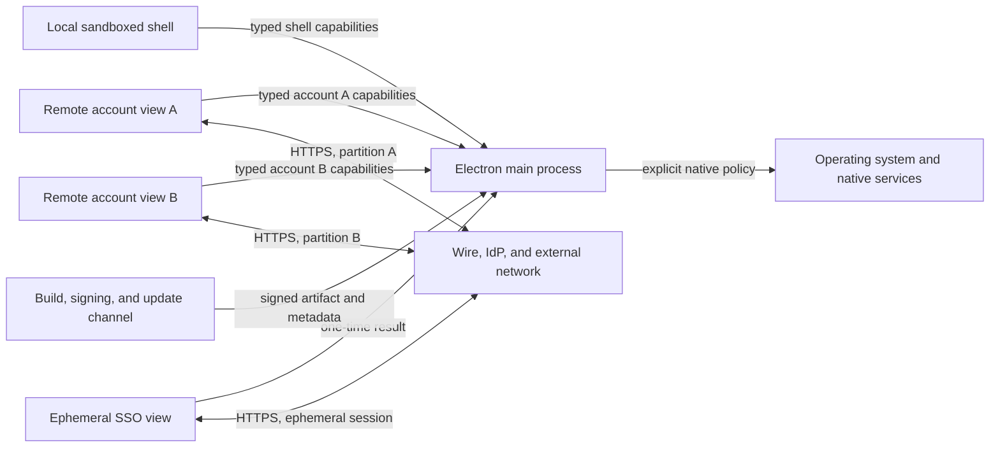

# Desktop wrapper threat model

## Scope and security objective

This model covers the Electron main process, local shell renderer, remote account renderers, preloads, IPC, sessions, SSO, deep links, native integrations, renderer-initiated main-process network access, packaging, installers, and updates. The remote Wire webapp and identity-provider pages are treated as potentially compromised inputs even when delivered from an approved origin.

The primary objective is to prevent compromise of remote content from becoming host compromise, cross-account compromise, persistence, or release-channel compromise while retaining explicitly approved desktop capabilities.

## Assets

- User messages, account identifiers, authentication cookies/tokens, cryptographic material, and safe-storage plaintext.
- Per-account browser storage and session state.
- Host filesystem, clipboard, camera, microphone, display, notifications, shell, credentials, proxy settings, and managed configuration.
- Main-process authority, IPC capabilities, application configuration, signing keys, update metadata, and distributed artifacts.
- User intent: which account, link, permission, download, login, or update the user intended to operate on.

## Attackers and assumptions

| Attacker | Capability assumed |
| --- | --- |
| Compromised remote webapp or IdP | Arbitrary script in one remote renderer, malicious navigation and popup requests, malformed/oversized bridge messages |
| Malicious external site | Crafted redirects, SSO responses, links, content types, downloads, and Open Graph targets |
| Malicious local process/user | Deep-link invocation, environment/CLI manipulation, profile-file modification, protocol races; no assumed kernel or administrator compromise |
| Compromised dependency/build input | Malicious install/build script or privileged package code, artifact substitution, vulnerable native module |
| Network attacker | Redirect/DNS/proxy/certificate interference where transport or enterprise interception policy permits it |
| Cross-account attacker | Control of one authenticated account renderer attempting to access another account's session or native capabilities |

The OS security boundary, Electron sandbox, signing platform, and Wire backend authentication are relied upon but not assumed infallible. A fully compromised OS or stolen signing authority is outside the application's preventive boundary and requires operational response.

## Trust boundaries and data flow

Every arrow crossing into `MAIN` is a privilege boundary. Origin alone is insufficient identity: authorization must bind the exact `WebContents`, frame, view type, account, partition, and capability registered by the main process.

## Entry points

- IPC events/invocations and preload bridge functions.
- Navigation, `window.open`, downloads, context menus, and external URL opening.
- `wire://` and SSO custom protocols, startup arguments, and second-instance events.
- Browser permissions, display capture, notifications, clipboard, safe storage, managed config, and proxy/certificate callbacks.
- SSO cookies and authorization response parameters.
- Open Graph URLs, redirects, response headers/bodies, and embedded image URLs.
- Persistent profiles, configuration files, logs, environment variables, and command-line switches.
- NPM dependencies, native modules, build scripts, signing inputs, update metadata, and installers.

## Threat register

| ID | Threat and failure mode | Risk | Required controls | Invariants | Work |
| --- | --- | --- | --- | --- | --- |
| THR-001 | Remote script reaches Node, Electron, `@electron/remote`, or an over-broad preload | critical | Sandbox and context isolation; no Node/remote; narrow frozen bridge | INV-001, INV-002 | SEC-004, SEC-005, SEC-006, SEC-007 |
| THR-002 | Forged IPC invokes filesystem, safe storage, capture, account deletion, network, or app lifecycle authority | critical | Main-owned identity registry; sender/frame/origin checks; schemas; size/rate limits | INV-003, INV-010 | SEC-002, SEC-003, TST-004 |
| THR-003 | One account reads/mutates another account's cookies, storage, encryption result, notification route, or desktop state | critical | Unique main-owned partitions and account-scoped capabilities; cross-account deny tests | INV-003, INV-004 | SEC-002, SEC-003, CAP-001 |
| THR-004 | Navigation/popup/external-link escape reaches an unapproved origin or dangerous local protocol | high | Central allow/deny policy; validate every redirect; deny by default | INV-005, INV-010 | SEC-008, SEC-013 |
| THR-005 | Crafted deep link performs arbitrary routing, recursive launch, oversized parsing, or confused SSO/account action | high | Strict action schemas and length limits; lifecycle-aware dispatch; no arbitrary IPC mapping | INV-005, INV-010 | SEC-013, CAP-006 |
| THR-006 | SSO response is replayed, forged, reordered, oversized, or transfers cookies into the wrong account | critical | One-time nonce; exact scheme/host/type; expiry/order; intended-session binding; cleanup on every terminal path | INV-003, INV-004, INV-005, INV-010 | TST-002, CAP-002 |
| THR-007 | Renderer-controlled URL makes privileged main process access loopback, private, link-local, metadata, file, or redirect targets | critical | URL/IP policy before request and after every redirect; protocol, byte, time, and redirect limits; no ambient credentials | INV-007, INV-010 | SEC-012 |
| THR-008 | Camera, microphone, display, clipboard, or notification permission is granted to the wrong view/origin or without user intent | high | Central permission policy bound to identity and gesture; default deny; packaged tests | INV-003, INV-006 | SEC-009, CAP-003, CAP-004 |
| THR-009 | Local shell injection or unsafe `file://`/CSP behavior pivots into privileged bridge authority | high | Privileged custom scheme, restrictive production CSP, no `unsafe-eval`, typed shell-only capabilities | INV-002, INV-008 | SEC-005, SEC-010 |
| THR-010 | Proxy/certificate exception weakens transport security globally or leaks credentials across sessions | high | Session-scoped handlers; explicit enterprise policy; bounded prompts; fail closed | INV-004, INV-006, INV-010 | CAP-005, TST-004 |
| THR-011 | Hostile local environment changes runtime behavior or loads unpackaged code | high | Reviewed fuses, asar-only/integrity controls, argument/environment policy, secret-safe logs | INV-009, INV-010 | SEC-011, PKG-001 |
| THR-012 | Compromised dependency, updater, installer, or artifact establishes persistent code execution | critical | Supported dependencies; lockfile; constrained scripts; signing/notarization; verified metadata; upgrade/rollback tests | INV-009, INV-010 | ELC-002, ELC-003, PKG-001, PKG-002, REL-001 |
| THR-013 | View crash/destruction leaves stale identity, handlers, permissions, or session references reusable | high | Atomic registry removal; explicit `webContents.close()`; idempotent teardown; crash recovery tests | INV-003, INV-004, INV-010 | ARC-001, SEC-002, CAP-001 |
| THR-014 | Sensitive tokens, URLs, content, or credentials enter logs and retained CI artifacts | high | Structured redaction; no secret-bearing errors; scoped retention and access | INV-010 | SEC-003, REL-001 |

## Existing positive controls

The legacy implementation already disables Node integration for its primary window, denies SSO permissions, rejects some dangerous external protocols, sets several useful fuses, encrypts cookies, limits SSO parameter length, and uses persistent partitions per account. These controls reduce risk but do not close the threats because the remote preload remains unsandboxed and uses `@electron/remote`, IPC sender authorization is inconsistent, account-view navigation is not prevented, and main-process fetch policy is incomplete.

## Verification strategy

Each critical/high threat must have at least one automated deny-path test. THR-001 through THR-009 and THR-013 require real-Electron hostile-renderer coverage in addition to policy unit tests. THR-006 requires a controlled SSO fixture. THR-011 and THR-012 require packaged artifacts and a separately recorded security-review pass; development-mode tests cannot satisfy them. Independent review remains desirable before public release but is not misrepresented as available during solo development.

## Residual risks and acceptance authority

| Residual risk | Required owner | Acceptance authority | Status |
| --- | --- | --- | --- |
| A zero-day Electron/Chromium sandbox escape remains possible | adamlow-wire | Solo maintainer; external reviewer if available | Reduce through current releases; not accepted for an EOL runtime |
| Product-required enterprise certificate interception may reduce transport guarantees | adamlow-wire | Solo maintainer | Policy details unresolved under Q-005 |
| Real IdP behavior cannot be represented completely by a deterministic fixture | adamlow-wire | Solo maintainer | Protocol-level automation; record provider evidence when available |
| A compromised administrator/OS can inspect or replace user-space state | adamlow-wire | Solo maintainer | Documented platform assumption; signing/integrity still required |
| Supply-chain compromise of signing authority bypasses application checks | adamlow-wire | Solo maintainer; signing authority for release | Requires operational key protection and incident response |

The model is technically complete. In the solo workflow, the maintainer's review and merge of PR #1 records acceptance; the M0 closure PR records that outcome in project status. This is self-review and is not described as independent security assurance.
